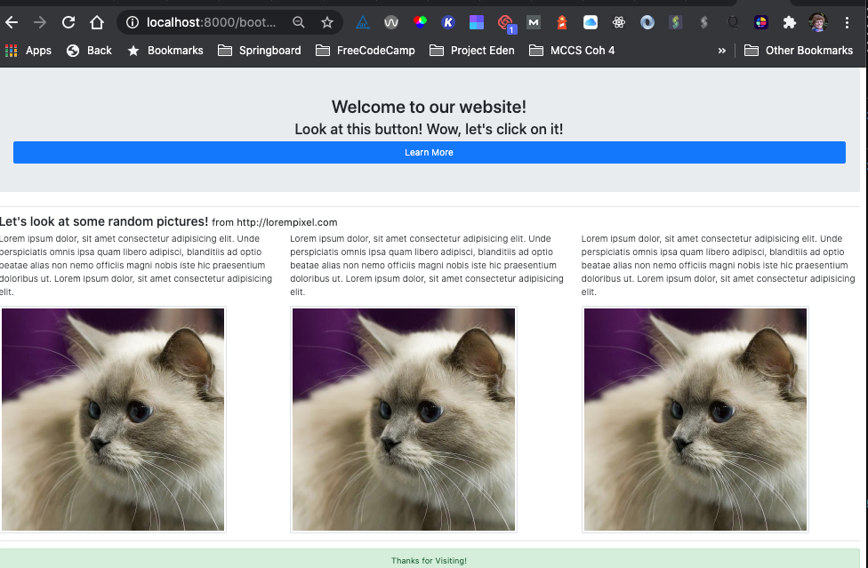

# How Web Works Exercise

[Source](http://curric.rithmschool.com/springboard/exercises/how-web-works/ "Permalink to How Web Works Exercise")

## Part One: Solidify Terminology

In your own terms, define the following terms:

- What is HTTP?

  A: HTTP stands for hypertext transfer protocol.

- What is a URL?
  A: THis is often called a "web address." URL stands for universal resource locator.

- Describe the different parts of a URL.

  _A: It contains information about the protocol, hostname, resource, and query. THere is also a default port assigned if we don't specify one._

  - _hostname: this is the human-readable name that the DNS server turns into an IP address_
  - _resource: specifies the content we're looking for on the site_
  - _query: this part is OPTIONAL and provides additional information like search terms, information from a form, etc._

- What is an IP?

  _A: IP stands for Internet Protocol._

- What is DNS?

  _A: DNS stands for Domain Name System. It works like an old school phone book for the **web** where the **hostname** we type into the address bar gets turned into an IP address that the computer can use. It can also do reverse lookups._

- What is a query string?

  _A: A query string is part of a URL. It provides additional information, and is optional. It takes the form of key-value pairs. Example: typing a search term tells the computer exactly what part of the resource we're looking for. Or it might tell how we want data sorted._

- What are two HTTP verbs and how are they different?

  _A: GET and POST are two HTTP verbs. GET requests do not change server data; they are just requests to get information (a web page, search results). POST requests, on the other hand, do have side effects, such as updating a database (e.g., posting a message to social media)._

- What is an HTTP request?

  _A: An HTTP request is a request made by our browser according to the standardized Hypertext Transfer Protocol. It includes things like _

- What is an HTTP response?

  _A: An HTTP response is what comes back from the server when an HTTP request is sent._

- What is an HTTP header? Give a couple examples of request and response headers you have seen.
  _A: _

- What are the processes that happen when you type “<http://somesite.com/some/page.html>” into a browser?

  _A: The browser sends the hostname to a DNS server to get the IP address (if the IP address is not already available in the local cache). Then it makes a request to the server at the IP address to get the requested content. The request contains:_

  - _a method (GET, POST, etc.)_
  - _an HTTP version (almost always 1.1)_

## Part Two: Practice Tools

1. Using curl, make a GET request to the _icanhazdadjoke.com_ API to find all jokes involving the word “pirate”

2. Use dig to find what the IP address is for _icanhazdadjoke.com_

_A: I typed 'dig icanhazdadjoke.com' into the terminal. There were three results, all with status code 300:_

- _104.27.178.209,_
- _104.27.179.209, and_
- _172.67.153.24_

3. Make a simple web page and serve it using python3 -m http.server. Visit the page in a browser.

_A: Here is the code I typed in:_

_Here is the rendered page at localhost:8000:_

## Part Three: Explore Dev Tools

Build a very simple HTML form that uses the GET method (it can use the same page URL for the action) when the form is submitted.

See index.html:

Add a field or two to the form and, after submitting it, explore in Chrome Developer tools how you can view the request and response headers.

Edit the page to change the form type to POST, refresh in the browser and re-submit. Do you still see the field in the query string?

_A: No_

Explore in Chrome how you can view the request and response headers, as well as the form data.

## Part Four: Explore the URL API

At times, it’s useful for your JavaScript to look at the URL of the browser window and change how the script works depending on parts of that (particularly the query string).

[Read about the URL API](https://developer.mozilla.org/en-US/docs/Web/API/URL)

Try some of the code examples in the Chrome Console so that you can get comfortable with the basic methods and properties for instances of the URL class.

## Solution

You can [view our solution](http://curric.rithmschool.com/springboard/exercises/how-web-works/solution/index.html)
